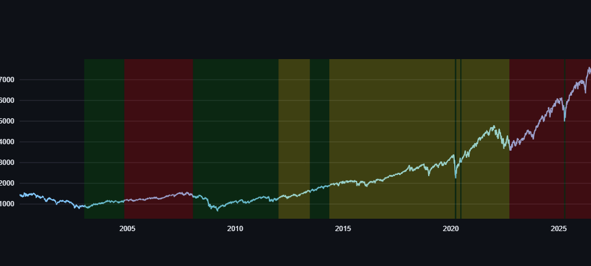

# Macro Regime Dashboard

**[](https://macro-dashboard-f4zgqcgxwqfxzz67jbpkhq.streamlit.app/)**



A live web application that monitors global macroeconomic and financial conditions in near real-time and automatically detects market regimes using a Hidden Markov Model. The dashboard updates daily from public data sources and is accessible to anyone without installation.

---

## Objective

This project builds an end-to-end macro monitoring infrastructure: from raw data ingestion across three public APIs (FRED, yfinance), to derived indicator construction, unsupervised regime classification, and interactive visualization deployed as a public web application. It replicates the core workflow of a macro research desk or tactical asset allocation team: every day, these teams monitor financial conditions, track the position in the economic cycle, and update their regime view. The pipeline covers the period 2000–present, capturing three full cycles including the dot-com bust, the 2008 financial crisis, the COVID shock, and the 2022 tightening cycle.

---

## Project Structure

```
macro-dashboard/
│
├── app.py                    ← Streamlit entry point
│
├── src/
│   ├── macro_data.py         ← data download from FRED and yfinance
│   ├── indicators.py         ← derived indicator construction
│   ├── hmm_model.py          ← Hidden Markov Model regime detection
│   └── charts.py             ← interactive Plotly visualizations
│
├── config/
│   └── indicators.yaml       ← indicator configuration and FRED series IDs
│
├── .streamlit/
│   └── config.toml           ← Streamlit theme configuration
│
├── requirements.txt
└── README.md
```

---

## Motivation: Why Regime Detection?

Financial markets do not behave uniformly through time. There are periods of calm expansion where equities rise steadily and volatility is low, periods of stress where correlations spike and everything falls together, and transitional phases where inflation is rising, curves are flattening, and the cycle is turning. These are market regimes, and identifying them correctly is central to risk management and portfolio construction.

The problem is that regimes are latent: they cannot be observed directly, only inferred from the data. A rule-based approach, ("if the yield curve inverts, it is a recession") is too rigid and reacts too slowly. A Hidden Markov Model offers a principled probabilistic alternative: given a set of observed indicators, the model estimates the probability of being in each regime at every point in time, and learns the transition dynamics between states.

This is the approach used by macro hedge funds (Bridgewater's All Weather framework is the canonical example) and by the tactical asset allocation teams at large asset managers.

---

## Data Sources

**FRED (Federal Reserve Economic Data):** the primary source for macroeconomic series — GDP, unemployment, CPI, policy rates, yield curve, and credit spreads. Accessed via the fredapi library with a free API key. 19 series are loaded covering growth, labor, inflation, rates, and credit categories.

**yfinance:** for daily market prices like equity indices, VIX, dollar index, gold, and oil. 7 tickers covering equity, volatility, FX, and commodities.

All series are loaded from January 2000 to the present day and refreshed on a TTL-based cache: hourly for market data, daily for macro series and the HMM model.

---

## Methodology

### Derived Indicators

Five indicators are constructed from the raw data before being passed to the model:

**Yield curve slope:** the spread between the US 10Y and 2Y Treasury yield. When negative it has preceded every US recession of the past 50 years with a lag of 12–24 months. It is arguably the most reliable leading indicator in macroeconomics.

**Real interest rate:** the 10Y nominal Treasury yield minus the 5Y breakeven inflation rate (a market-based measure of inflation expectations). When real rates are negative, financial conditions are historically accommodative for risk assets.

**Excess equity return:** the rolling 12-month return of the S&P 500 minus the Fed Funds Rate. Measures how much equities are outperforming cash.

**Rolling correlation:** the 60-day rolling correlation between the S&P 500 and the high yield credit spread. When positive it signals systemic stress.

**Financial Conditions Index (FCI):** a composite indicator constructed as the equal-weighted mean of z-scores across five components: VIX, yield curve slope, high yield spread, S&P 500 rolling 60-day return, and real interest rate. A high FCI indicates restrictive financial conditions; a low FCI indicates accommodative conditions. There is no single standard definition of an FCI. This construction follows the general approach used by the Federal Reserve and IMF in their published indices.

### Hidden Markov Model

The HMM is a generative probabilistic model that assumes the observed data is produced by a latent Markov chain with K discrete states. At each time step, the model occupies one of K hidden states with some transition probability, and the observations are drawn from a Gaussian distribution specific to that state. The model parameters, which are emission means and covariances, and the transition matrix, are learned from data via the Baum-Welch algorithm (Expectation-Maximization).

**Implementation:** hmmlearn.hmm.GaussianHMM with diagonal covariance (covariance_type="diag") and K=3 states, fitted on the full 2000–present history using 1000 EM iterations. The feature set passed to the model consists of four standardized indicators: yield curve slope, real interest rate, financial conditions index, and VIX.

**Why K=3:** three states are the minimal representation that captures the three recognizable phases of a macro cycle: expansion, transition, and contraction. A fourth state for stagflation (high inflation + low growth) is a natural extension. Beyond four states, interpretability degrades faster than fit quality improves.

**Label assignment:** the HMM is unsupervised — the states have no labels at training time. Labels are assigned post-hoc by inspecting the mean characteristics of each state and the historical periods to which observations are assigned. The mapping below was confirmed by verifying that crisis episodes fall into the expected regime.

---

## Regime Characteristics

| | Regime 0 — Contraction | Regime 1 — Transition | Regime 2 — Expansion |
|---|---|---|---|
| VIX (mean) | 21.7 | 24.5 | 13.3 |
| Yield Curve Slope (mean) | 0.68 | 2.29 | 0.59 |
| Real Interest Rate (mean) | 0.53 | 1.35 | 1.17 |
| FCI (mean) | -0.18 | +0.54 | -0.19 |
| Observations | 1,868 | 1,676 | 2,503 |

**Regime 0 — Contraction/Risk-Off:** elevated VIX, flat curve, restrictive financial conditions. This regime covers the 2008–2009 financial crisis and subsequent stress episodes. The current regime as of June 2026.

**Regime 1 — Transition/Late Cycle:** the highest VIX and the steepest curve (a combination typical of periods where monetary policy is tightening aggressively and the cycle is turning). Covers the 2004–2006 and 2022–2023 tightening episodes.

**Regime 2 — Expansion/Risk-On:** the lowest VIX (13.3), accommodative financial conditions. Covers the 2013–2019 post-crisis expansion and the 2020–2021 stimulus-driven recovery.

### Transition Matrix

The transition matrix shows the daily probability of moving between regimes. High diagonal values indicate regime persistence which means that once the economy enters a state, it tends to stay there.

---

## Dashboard Sections

**Current Regime:** the primary view. S&P 500 price history overlaid with colored regime bands: green for Expansion, yellow for Transition, red for Contraction. The regime is updated daily as new data arrives.

**Yield Curve:** the 10Y–2Y slope over time with NBER recession bands (2001, 2008–2009, 2020) marked in grey. The 2022–2023 inversion is clearly visible.

**Financial Conditions:** the FCI over time with red shading above zero (restrictive) and green shading below zero (accommodative). The 2008 spike to +2.8 and the 2022 spike to +1.7 mark the two most restrictive episodes of the sample.

**Macro Heatmap:** a 24-month z-score heatmap of seven key indicators. Each cell shows how far that indicator is from its historical mean in that month — green for above average, red for below average. Allows rapid identification of diffuse deterioration or improvement across multiple indicators simultaneously.

---

## Discussion

**HMM limitations.** The model classifies the present. The assignment of observations to regimes is stable in-sample but may differ on out-of-sample data as the unconditional distribution of the features shifts. The number of states is a design choice, not a parameter estimated from data. The model uses only macro and market indicators.

**FCI construction.** The equal-weighting of z-score components is a simplification. Published FCIs (Chicago Fed NFCI, Goldman Sachs FCI) use principal component analysis or factor models to assign weights based on historical variance explained. The construction here is transparent and replicable but would underweight components with lower historical variance.

**Data coverage.** The TEDRATE series (TED spread) was discontinued by FRED in 2023. The high yield spread series (BAMLH0A0HYM2) begins only in 2010, limiting its use as an HMM feature. Both series are still displayed in the dashboard where available.

---
